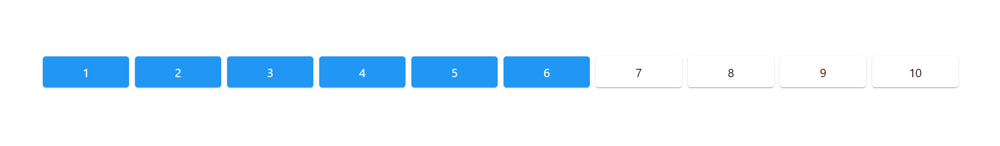
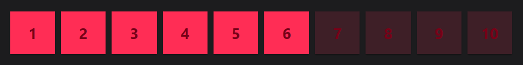

# material-number-scale-rating

Light Preview (Based on parent component background color):



Dark Preview (Based on parent component background color):



To import the component:

```javascript
import MaterialNumberRating from 'react-material-number-rating';
```

To use it call component named:

```javascript
<MaterialNumberRating start={} end={} current={} mouseEnteredOn={} clickedOn={}/>
```

Pass rating start, end, current value. Example:

```javascript
<MaterialNumberRating start={1} end={10} current={5} mouseEnteredOn={} clickedOn={}/>
```

To get rating value use React.useCallBack from parent component. Example:

Parent component:

```javascript
import { useCallback } from "react";

const mouseEnteredOn = useCallback((current_rating) => {
    console.log(current_rating);
}, []);
```


Pass this callback to _MaterialNumberRating_ component like this:

```javascript
<MaterialNumberRating start={1} end={10} current={5} mouseEnteredOn={mouseEnteredOn} clickedOn={}/>
```

To Get which rating value clicked use React.useCallBack from parent component. Example:

Parent component:

```javascript
const clickedOn = useCallback((current_rating) => {
    console.log(current_rating);
}, []);
```

Pass this callback to _MaterialNumberRating_ component like this:

```javascript
<MaterialNumberRating start={1} end={10} current={5} mouseEnteredOn={mouseEnteredOn} clickedOn={clickedOn}/>
```

There are some optional properties for customization:

```javascript
itemPerGrid : number //example = 3
backgroundColor : string //example = "#FF2D5526"
textColor : string //example = "#780017"
onActiveBackgroundColor : string //example = "#FF2D55"
onActiveTextColor : string //example = "#780017"
padding : [paddingTop, paddingBottom, paddingRight, paddingLeft] //example = [15, 15, 0, 0]
spacing: number //example = 2
borderRadius : number //example = 0
fontWeight: string //example = "bolder"
fontSize: number //example = 20
```