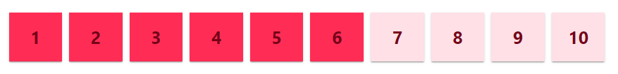

# material-number-scale-rating

Preview:



To import the component:

```javascript
import MaterialNumberRating from 'react-material-number-rating';
```

To use it Call Component named:

```javascript
<MaterialNumberRating start={} end={} mouseEnteredOn={} clickedOn={}/>
```

Pass Rating Start and end Value. Example:

```javascript
<MaterialNumberRating start={1} end={10} mouseEnteredOn={} clickedOn={}/>
```

To Get Rating Value use React.useCallBack from parent component. Example:

Parent Component:

```javascript
import { useCallback } from "react";

const mouseEnteredOn = useCallback((current_rating) => {
    console.log(current_rating);
}, []);
```


Pass this callback to MaterialNumberRating component like this:

```javascript
<MaterialNumberRating start={1} end={10} mouseEnteredOn={mouseEnteredOn} clickedOn={}/>
```

To Get which rating value clicked use React.useCallBack from parent component. Example:

```javascript
const clickedOn = useCallback((current_rating) => {
    console.log(current_rating);
}, []);
```

Pass this callback to MaterialNumberRating component like this:

```javascript
<MaterialNumberRating start={1} end={10} mouseEnteredOn={mouseEnteredOn} clickedOn={clickedOn}/>
```

There are some optional properties for customization:

```javascript
backgroundColor : string //example = "#FF2D5526"
textColor : string //example = "#780017"
onActiveBackgroundColor : string //example = "#FF2D55"
onActiveTextColor : string //example = "#780017"
padding<number>[paddingTop, paddingBottom, paddingRight, paddingLeft] //example = [15, 15, 0, 0]
spacing: number //example = 2
required: bool // example = false
borderRadius : number // example = 0
fontWeight: string // example = "bolder"
fontSize: number // example = 20
```